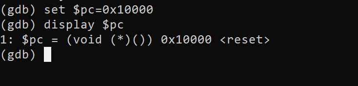

# Mastering-Embedded-System
# [www.learn-in-depth.com](https://www.learn-in-depth.com/online-diploma/omaradelshalaan%40gmail.com)

# Lab_1
### ==> Running

## MAKEFILE
### ==> make

### ==> make objdump

### ==> make readelf

### ==> make clean

## GDB
### Terminal 1:
qemu-system-arm -M versatilepb -m 128M -nographic -s -S -kernel  learn-in-depth.bin

### Terminal 2:
arm-none-eabi-gdb Learn-in-depth.elf
target remote localhost:1234

## ==> l

## ==> s

## ==> si

## ==> display

## ==> display/10i $pc 

## ==> watch

## ==> b

## ==> info breakpoints

## ==> c

## ==> set $pc=0x10000
