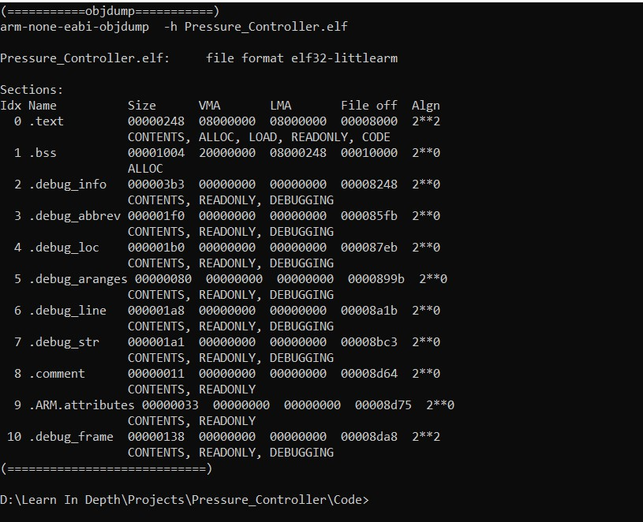
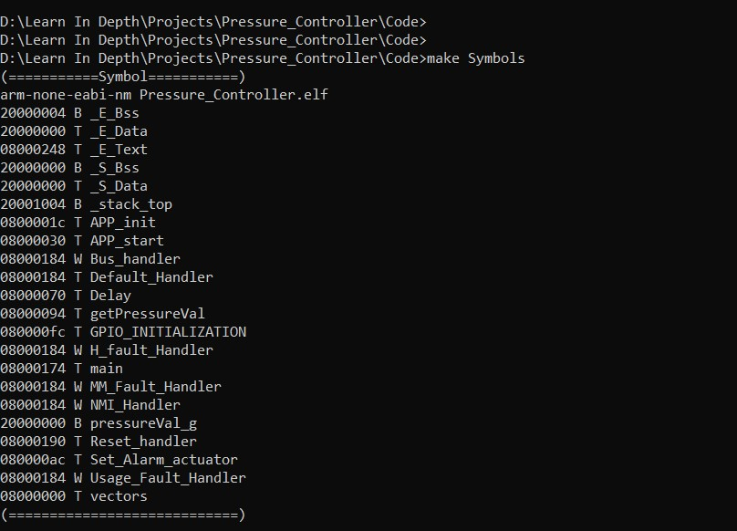
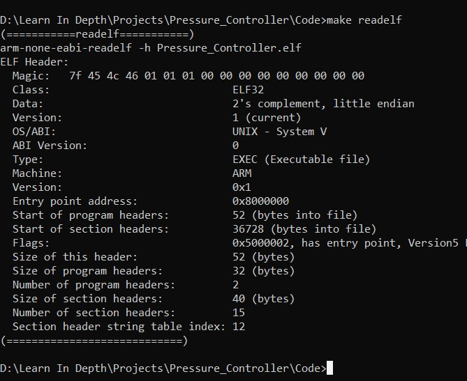
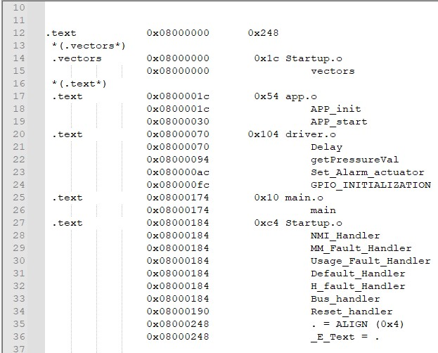
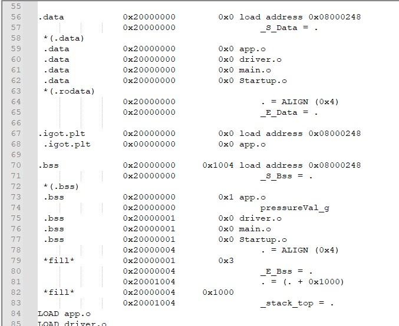
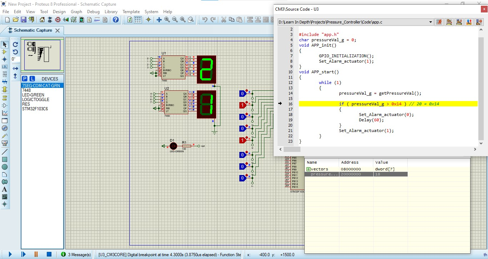
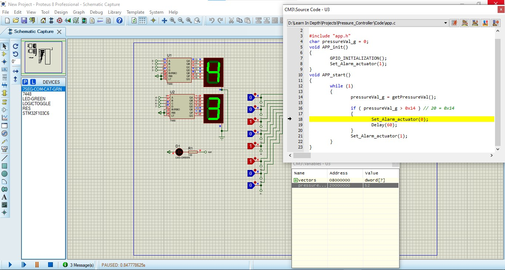
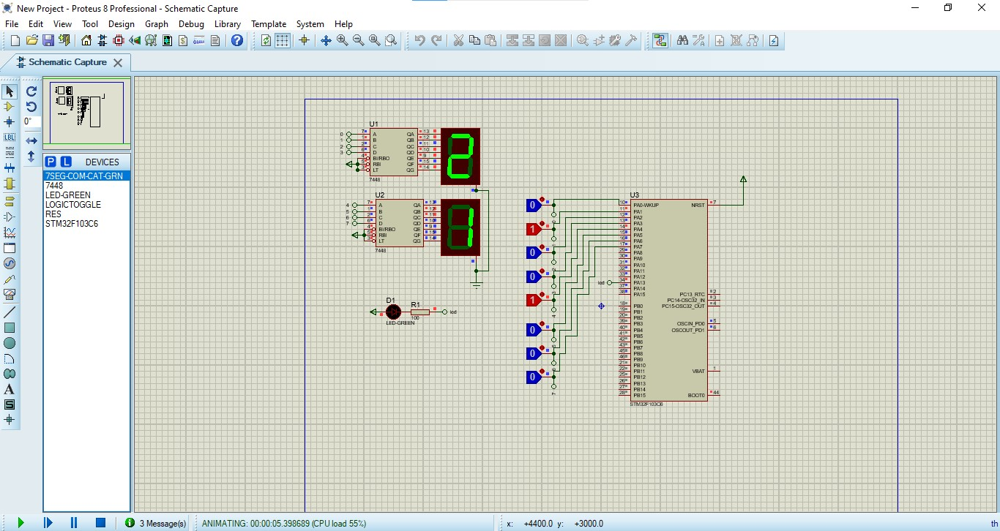
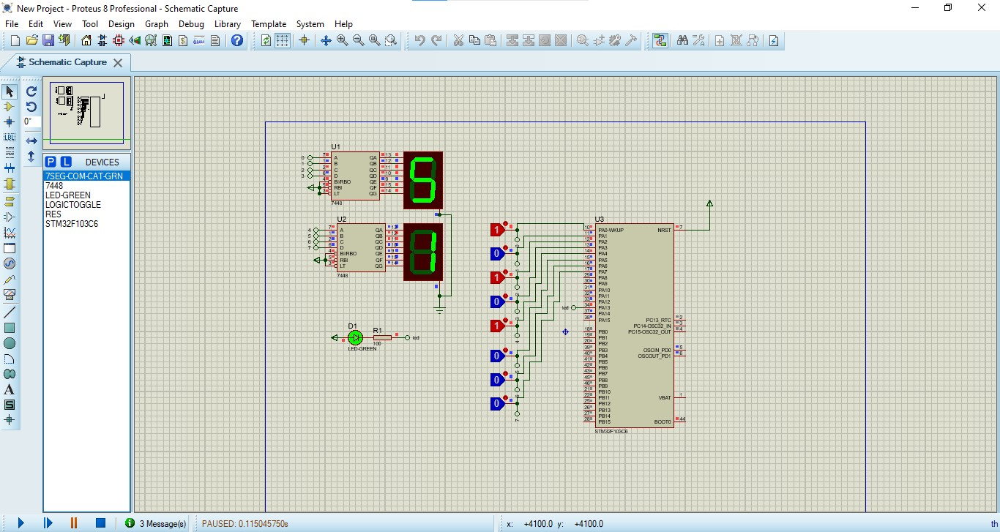

# Mastering-Embedded-System

## Eng: Omar Adel Shalaan

### [Resume Repo]() [Linkedin Profile](https://www.linkedin.com/in/omar-adel-shalaan-67aaa714b/) [My Learn In Depth Profile](https://www.learn-in-depth.com/online-diploma/omaradelshalaan%40gmail.com)

# Pressure Controller
	
## Code
- [main.c](./Code/main.c)
- [app.h](./Code/app.h)
- [app.c](./Code/app.c)
- [driver.h](./Code/driver.h)
- [driver.c](./Code/driver.c)
- [Startup.c](./Code/Startup.c)
- [Linker_Script.ld](./Code/Linker_Script.ld)
- [makefile](./Code/makefile)
	
### Code Photos

## Proteus
- [proteus file](./proteus/proteus)
	
### Proteus Debug

### Proteus Run

