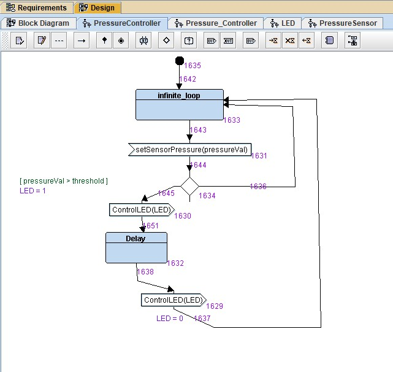

# Mastering-Embedded-System

## Eng: Omar Adel Shalaan

### ([Resume Repo](https://github.com/OmarAdelShalaan/My-Resume#projects)) ([Linkedin Profile](https://www.linkedin.com/in/omar-adel-shalaan-67aaa714b/)) ([My Learn In Depth Profile](https://www.learn-in-depth.com/online-diploma/omaradelshalaan%40gmail.com))

# Pressure Controller

## TTool

### Requirements Diagram

### System Analysis

#### Case Diagram

#### Activity Diagram

#### Sequence Diagram

### System Design

### Run System Design

