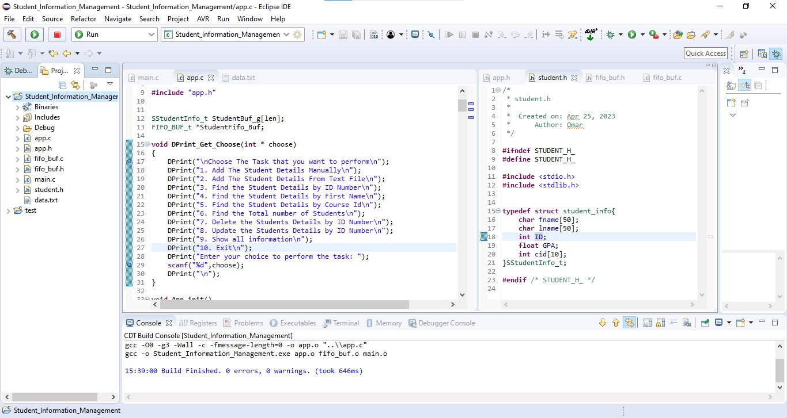
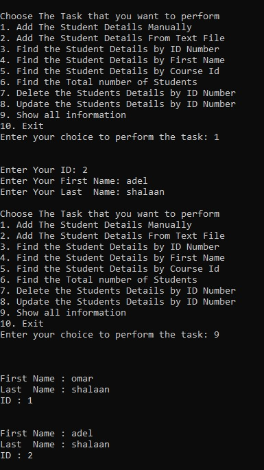
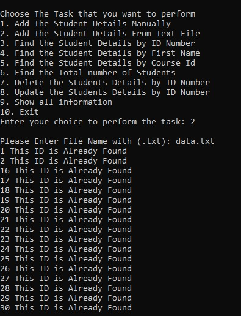
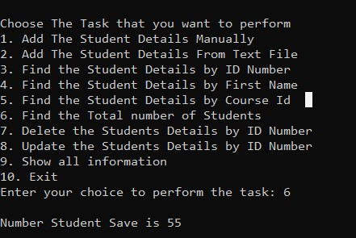
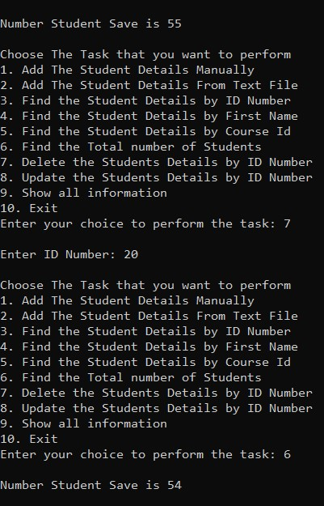
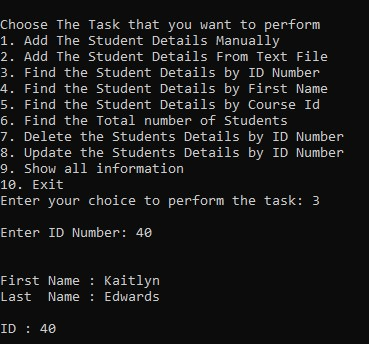
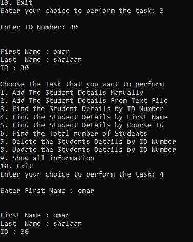
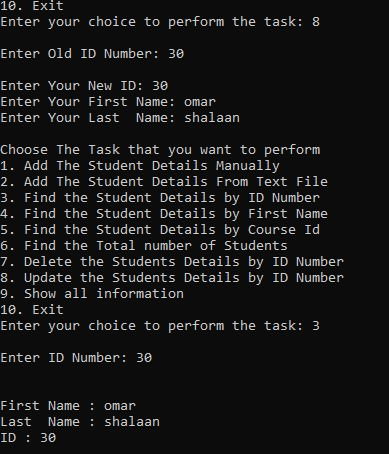

# Mastering-Embedded-System

## Eng: Omar Adel Shalaan

### ([Resume Repo](https://github.com/OmarAdelShalaan/My-Resume#projects)) ([Linkedin Profile](https://www.linkedin.com/in/omar-adel-shalaan-67aaa714b/)) ([My Learn In Depth Profile](https://www.learn-in-depth.com/online-diploma/omaradelshalaan%40gmail.com))

# Student Information Management
	
## Code
- [main.c](./Code/main.c)
- [app.h](./Code/app.h)
- [app.c](./Code/app.c)
- [fifo_buf.h](./Code/fifo_buf.h)
- [fifo_buf.c](./Code/fifo_buf.c)  
- [student.h](./Code/student.h) 
- [data.txt](./Code/data.txt)

### Functios 

### Try Project 
- [Student_Information_Management.exe](./Code/Debug/Student_Information_Management.exe)
		- don't forget download data.txt file 
