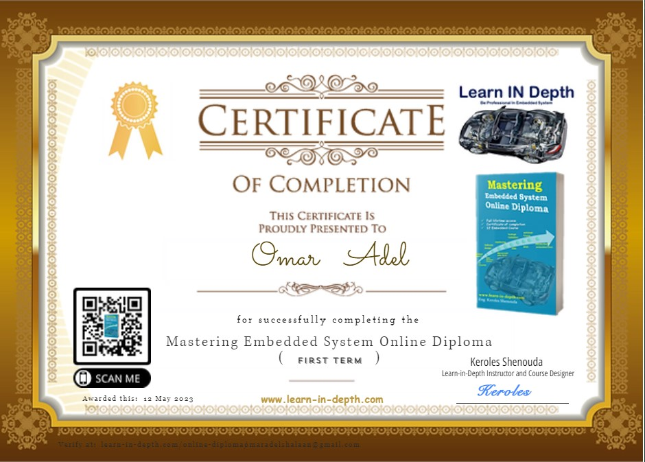

# Mastering-Embedded-System

## Eng: Omar Adel Shalaan

### ([Resume Repo](https://github.com/OmarAdelShalaan/My-Resume#projects)) ([Linkedin Profile](https://www.linkedin.com/in/omar-adel-shalaan-67aaa714b/)) ([My Learn In Depth Profile](https://www.learn-in-depth.com/online-diploma/omaradelshalaan%40gmail.com))

# Diploma Content

## First Term 
- Unit 2: 
	- C Programming
- Unit 3:
	- Embedded C
- Unit 4: 
	- system architect 
	- Data Structure

## Projects
- Pressure Controller [LINK](./Projects/Pressure_Controller)

