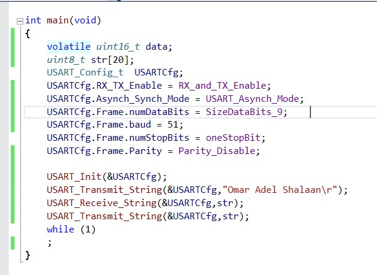
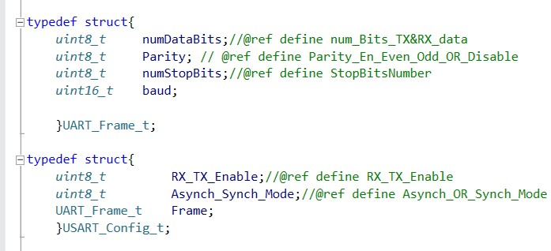
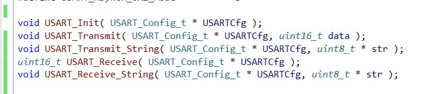

# Serial Communication Protocols

# UART (Universal Asynchronous Receiver/Transmitter)

# USART Atmega32 Driver

## Files
- [main.c](./main.c)
- [USART.h](./ATmega_USART_Driver.h)
- [USART.c](./ATmega_USART_Driver.c)
- [USART_REG.h](./REG_Macros.h)

# main Function

# USART Configuration

# USART Functions

## Proteus

