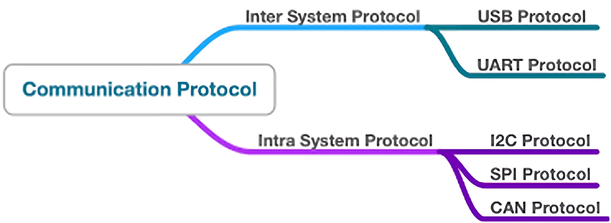

# Mastering-Embedded-System
# [www.learn-in-depth.com](https://www.learn-in-depth-store.com/certificate/omaradelshalaan%40gmail.com)

# Communication Protocols

# Serial Communication Protocols
-  ## UART (Universal Asynchronous Receiver/Transmitter)
   - ### USART Atmega32 Driver [Link](./Atmega_USART_Driver) 
-  ## SPI

